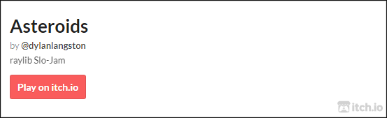

[//]: https://github.com/adam-p/markdown-here/wiki/Markdown-Cheatsheet

# Astroids Game 🪨

<p align="center">
  <a href="https://ziglang.org/download"></a>
  <a href="https://www.raylib.com/"></a>
  <a href="https://github.com/dylanlangston/astroids/actions/workflows/DeployPages.yml"></a>
  <a href="https://github.com/dylanlangston/astroids/blob/main/LICENSE"></a>
  <a href="https://github.com/dylanlangston/astroids/releases/latest"></a>
  <a href="https://api.github.com/repos/dylanlangston/astroids"></a>
</p>


This [Progressive Web App](https://developer.mozilla.org/en-US/docs/Web/Progressive_web_apps) is a submission to the 2023 *Raylib Slo-Jam* event hosted on [itch.io](https://itch.io/), It was created by [@dylanlangston](https://github.com/dylanlangston) using the following:
- [Zig](https://ziglang.org/)
- [raylib](https://www.raylib.com/) via [raylib-Zig](https://github.com/Not-Nik/raylib-zig/tree/devel)
- [raygui](https://github.com/raysan5/raygui) via [raygui.zig](https://github.com/ryupold/raygui.zig)
- [Emscripten](https://emscripten.org/)
- [Wizer](https://github.com/bytecodealliance/wizer)
- [Binaryen](https://github.com/WebAssembly/binaryen)
- [Svelte](https://svelte.dev/)
- [Typescript](https://www.typescriptlang.org/)
- [TailwindCSS](https://tailwindcss.com/)

#### What's raylib Slo-Jam?

> The goal of [raylib Slo-Jam](https://itch.io/jam/raylib-slo-jam) is to have participants all make the same kind of game, using raylib and not be rushed by short time constraints. The focus is on quality and polish, not scope and features. We want you to make the best game you can based on the theme. 
>
> Everyone who participates in the jam will be building the classic arcade game: **Asteroids**

<a href="https://dylanlangston.itch.io/astroids"></a>

------

### Getting Started
*This repository includes a [devcontainer.json](.devcontainer/devcontainer.json) to get up and running quickly with a full-featured development environment in the cloud!*[^local-development]

#### Clone
1. Clone this repository: `git clone https://github.com/dylanlangston/astroids.git`
2. Change directories into the newly created `./Astroids` folder. Then initialize the submodules: `git submodule update --init --recursive`

#### Debug Locally:
1. If you haven't already, install Zig version 0.11.0 using the [instructions here](https://ziglang.org/learn/getting-started/#installing-zig).
2. Configure you build environment for Raylib using the appropriate [instructions](https://github.com/raysan5/raylib/wiki#development-platforms) for you platform.
3. Finally, to start the game run the command `zig build run`. Alternatively run the **_Debug_** task in VSCode.

#### Build for Web:
1. Complete steps to __Clone__ and __Debug Locally__ above first.
2. Change directories into the `./Astroids` folder. Build the zig portion of the game using command `zig build -Dtarget=wasm32-emscripten`. Alternatively run the **_Build Web_** task in VSCode.
3. If you haven't already, install NodeJS LTS from [here](https://nodejs.org/en/download) (or your preferred source).
4. Change directories into the `./Astroids/src/astroid-website` folder. Then install the required node packages using `npm install`.
5. Build the web version by running the command `npm run build`. You can find the generated static site in the `./Astroids/src/astroid-website/build` folder.

------

### Credits
```TODO```

[^local-development]: For local development check out [Dev Containers](https://marketplace.visualstudio.com/items?itemName=ms-vscode-remote.remote-containers) and [DevPod](https://devpod.sh/).
