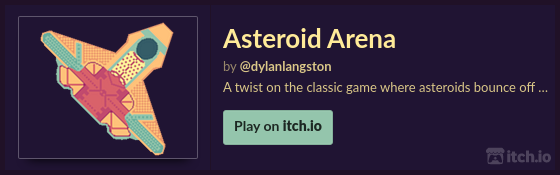

[//]: https://github.com/adam-p/markdown-here/wiki/Markdown-Cheatsheet

<a href="https://asteroids.dylanlangston.com/" title="Asteroid Arena 🪨">
  <p align="center">
    </img>
  </p>
</a>

<p align="center">
  <a href="https://itch.io/jam/raylib-slo-jam"></a>
  <a href="https://ziglang.org/download"></a>
  <a href="https://www.raylib.com/"></a>
  <a href="https://github.com/dylanlangston/asteroids/actions/workflows/DeployPages.yml"></a>
  <a href="https://github.com/dylanlangston/asteroids/blob/main/LICENSE"></a>
  <a href="https://github.com/dylanlangston/asteroids/releases/latest"></a>
  <a href="https://api.github.com/repos/dylanlangston/asteroids"></a>
</p>

Asteroid Arena is a twist on the classic game with an expanded world where asteroids bounce off the walls. Try to keep up as the amount of asteroids increases the more you destroy. Also watch out for rogue aliens!!

This [Mobile First](https://developer.mozilla.org/en-US/docs/Glossary/Mobile_First) [Progressive Web App](https://developer.mozilla.org/en-US/docs/Web/Progressive_web_apps) is a submission to the 2023 *Raylib Slo-Jam* event hosted on [itch.io](https://itch.io/), It was created by [@dylanlangston](https://github.com/dylanlangston) using the following:
- [Zig](https://ziglang.org/)
- [raylib](https://www.raylib.com/) via [raylib-Zig](https://github.com/Not-Nik/raylib-zig/tree/devel)
- [Emscripten](https://emscripten.org/)
- [Binaryen](https://github.com/WebAssembly/binaryen)
- [Svelte](https://svelte.dev/)
- [TypeScript](https://www.typescriptlang.org/)
- [TailwindCSS](https://tailwindcss.com/)

#### What's raylib Slo-Jam?

> The goal of [raylib Slo-Jam](https://itch.io/jam/raylib-slo-jam) is to have participants all make the same kind of game, using raylib and not be rushed by short time constraints. The focus is on quality and polish, not scope and features. We want you to make the best game you can based on the theme. 
>
> Everyone who participates in the jam will be building the classic arcade game: **Asteroids**

<a href="https://dylanlangston.itch.io/asteroids"></a>

------

### Getting Started
*This repository includes a [devcontainer.json](.devcontainer/devcontainer.json) to get up and running quickly with a full-featured development environment in the cloud!*[^local-development]

#### Clone
1. Clone this repository: `git clone https://github.com/dylanlangston/asteroids.git`
2. Change directories into the newly created `./asteroids` folder. Then initialize the submodules: `git submodule update --init --recursive`

#### Debug Locally:
1. If you haven't already, install Zig version 0.11.0 using the [instructions here](https://ziglang.org/learn/getting-started/#installing-zig).
2. Configure you build environment for Raylib using the appropriate [instructions](https://github.com/raysan5/raylib/wiki#development-platforms) for you platform.
3. Finally, to start the game run the command `zig build run`. Alternatively run the **_Debug_** task in VSCode.

#### Build for Web:
1. Complete steps to __Clone__ and __Debug Locally__ above first.
2. Change directories into the `./asteroids` folder. Build the zig portion of the game using command `zig build -Dtarget=wasm32-emscripten`. Alternatively run the **_Build Web_** task in VSCode.
3. If you haven't already, install NodeJS LTS from [here](https://nodejs.org/en/download) (or your preferred source).
4. Change directories into the `./asteroids/src/asteroids-website` folder. Then install the required node packages using `npm install`.
5. Build the web version by running the command `npm run build`. You can find the generated static site in the `./asteroids/src/asteroids-website/build` folder.

#### Localizing:
This application is fully localized into English, French, and Spanish. It should be possible to support any language using a Latin Character set. The following steps can be used to translate the application:

*Localizating the Zig portion:*
1. Open the `./src/Locales/` folder. Copy an existing locale `.zig` file and rename it to the appropriate language name. For example "german.zig".
2. Edit the new file by translating the strings to the choosen language (i.e. - German).
3. Open the `./src/Localelizer.zig` file. Add your new language to the __Locales__ enum, take note of the order for later. Then update the __Localelizer.get__ function to handle the new enum. The changes should look something like this:
```zig
pub const Localelizer = struct {
    pub inline fn get(locale: Locales) Locale {
        switch (locale) {
            Locales.german => {
                return @import("./Locales/german.zig").german;
            },
        }
    }
};
pub const Locales = enum(usize) {
    ...
    german,
};
```

*Localizating the Web portion:*
1. Open the `./src/asteroids-website/src/locales` folder. Copy an existing locale `.json` file and rename it to the appropriate language name. For example "de.json".
2. Edit the new file by translating the strings to the choosen language (i.e. - German).
3. Open the `./src/asteroids-website/static/manifests` folder. Copy an existing `manifest.json` file and rename it to the appropriate language name (i.e. - "de.manifest.json").
4. Edit the new manifest file and translate the appropriate strings to the choosen language (i.e. - German). [Read more about the manifest.json format here.](https://developer.mozilla.org/en-US/docs/Web/Manifest)
5. Open the `./src/asteroids-website/src/lib/localizer.ts` file. Add your new language to the __Locales__ enum, ensure the order is the same as the Zig enums you updated earlier. Update the __LocaleGroup.LocalePrefixes__ array with the new enum and the language prefix (the file name from step 1). The changes should look something like this:
```TypeScript
export enum Locales {
    ...
    german,
}

class LocaleGroup {
    public static readonly LocalePrefixes = [
        {
            key:   Locales.german,
            value: "de"
        },
    ];
}
```

------

### Credits
| Font | Source | License |
|:---- |:------:| -------:|
| _Hyperspace_ | https://www.fontspace.com/hyperspace-font-f18038 | Freeware, Non-Commercial |
| _Two Lines_ | https://www.fontspace.com/2-lines-font-f14541 | Freeware, Non-Commercial |

| Palette | Source |
|:-------:|:------:|
| _AKC12_ | https://lospec.com/palette-list/akc12 |

| Sound | Creator | Tool | Copy/Paste | License |
|:-------:|:------:|:---:|:---------- |:-------:|
| _[Acceleration](./src/Sounds/Acceleration.ogg)_ | [miajohnson99](https://github.com/miajohnson99) | [Chiptone](https://sfbgames.itch.io/chiptone) | `eNpjYig-PkOQgcFIngEIOhkZGBrq3RknMTEzvGH6X_-_ntXIGCTRUH_GB5WeEYldPE0NQjOsYzcynghi_7eHiMBowgJ8vG2nQbR3-ClGZDNhdv4HQ0cHixAGegIAUKwyuw..` | Creative Commons (by) Attribution |
| _[Alien Explosion](./src/Sounds/AlienExplosion.ogg)_ | [miajohnson99](https://github.com/miajohnson99) | [Chiptone](https://sfbgames.itch.io/chiptone) | `eNpjYig-PkOQieOMAQODHOvaOwwMDfUMDPNY-pmm8_2vV4pmEZBgYAAJnvGB0HdU_HVB9GNVHSMQnWG4-CiI7jEP7wPRaWpHHEA00zp2I-OJDAwKjM-lny4FiVxT3nkPbPx_e4hRMJoZXYCPt-00iPYOP8UIMRMiPiMSqg4MI1XmRzHQEwAAYv454w..` | Creative Commons (by) Attribution |
| _[Alien Pew](./src/Sounds/AlienPew.ogg)_ | [miajohnson99](https://github.com/miajohnson99) | [Chiptone](https://sfbgames.itch.io/chiptone) | `eNpjYig-PkOQgeWMQ8MpBjBoqGdgmMTUxiDH-r_eN4nFyBgieMYHQk-22HwXRDNqZ20E0TnqkTtBtHDe73kgOk0Nasg6diPjiQwMjEy8up4HQSIv1XbeA8v8t4cogdHM6AJ8vG2nQbR3-ClGZDNnRELVgWGkCsRNdAMAw4g3_g..` | Creative Commons (by) Attribution |
| _[Explosion](./src/Sounds/Explosion.ogg)_ | [miajohnson99](https://github.com/miajohnson99) | [Chiptone](https://sfbgames.itch.io/chiptone) | `eNpjYig-PkOQkSNNi4Hh6953dxgYGuoZGJJZH7P-4_pfrxTNIiDBwAASPOODSs-IxC6epnbEAUQzrmM3Mp7IwKDA-t8eIgOjGdAFmNEF-HjbToNo7_BTjBAzUe38D4amcqlpDPQEADcqNn8.` | Creative Commons (by) Attribution |
| _[Hit Wall](./src/Sounds/HitWall.ogg)_ | [miajohnson99](https://github.com/miajohnson99) | [Chiptone](https://sfbgames.itch.io/chiptone) | `eNpjYig-PkOQgeW_vlcrAxg01DMwlDHwM9kx_q__b898zRkieMYHQj9WNdsHomdEoorD6DQ1qCHr2I2MJ4LY_-0hIjCasAAfb9tpEO0dfooR2UyYnf_B0NEhOJmBngAA6yE0Wg..` | Creative Commons (by) Attribution |
| _[Med Explosion](./src/Sounds/MedExplosion.ogg)_ | [miajohnson99](https://github.com/miajohnson99) | [Chiptone](https://sfbgames.itch.io/chiptone) | `eNpjYig-PkOQg-O_MgND7X8GIGioZ2CYxDSD-R_X_3q9WAYjY4jgGR9UekYkdvE0tSMOIJpxHbuR8USQ2H97iAyMJizAx9t2GkR7h59ihJiJaud_MHTWdkhgoCcAAKqnNQY.` | Creative Commons (by) Attribution |
| _[Pew](./src/Sounds/Pew.ogg)_ | [miajohnson99](https://github.com/miajohnson99) | [Chiptone](https://sfbgames.itch.io/chiptone) | `eNpjYig-PkOQie2_vcFeAYkmBQaGhnp3RmaGcOaVLP_ra-IZjIwZGECCZ3wg9BGF3OMg-poz6zZkcRidpgahGdaxGxlPBDKZeHU9D4JEXqrtvAeimf7bQ5TAaGZ0AT7ettMg2jv8FCOymTMioerAMFKF15eBngAATc423A..` | Creative Commons (by) Attribution |
| _[Small Explosion](./src/Sounds/SmallExplosion.ogg)_ | [miajohnson99](https://github.com/miajohnson99) | [Chiptone](https://sfbgames.itch.io/chiptone) | `eNpjYig-PkOQgSNNjoGh9j8DEDTUMzCEM59j_Mf1v_6_PYORMUTwjA8qPSMSu3iaGtSQdexGxhNBbKAhYBEYTViAj7ftNIj2Dj_FiGwmzM7_YFhl8iCKgZ4AACVNNOI.` | Creative Commons (by) Attribution |

| Music | Creator | Tool | Link | License |
|:-------:|:------:|:---:|:----:|:-------:|
| _[Background](./src/Music/BackgroundMusic.ogg)_ | [miajohnson99](https://github.com/miajohnson99) | [BeepBox](https://www.beepbox.co/) | [Background](https://www.beepbox.co/#9n31s1k9l00e05t1Aa7g05j07r1i0o432T0v2u00f10l7q8142d35w2h0E0T5v2u50f0qwx10p511d08H-JJAArrqiih999h0E1b6T1v2u01f10r8q011d35AcF8B5Q0259P8998E0T3v3uf7f0qwx10m711d08SZIztrsrzrqiiiiiE1b6b4zhm4zhl4zdi4h4hp22mISLA2qJaHaAZlHJK3x1c3qXHqGiOGyox8vrdTmpHZ6WJJiLjIS5DAOJWYe8ebdHWEq-WHGL1qxkWHGL2oGKHaKFJvokBjjGicBsaq_4idkz9icz9q5dltBJR-FnprjljkFJv9kzt0yCL05dJdldl80) | Creative Commons (by) Attribution |
| _[Game Over](./src/Sounds/Gameover.ogg)_ | [miajohnson99](https://github.com/miajohnson99) | [BeepBox](https://www.beepbox.co/) | [Game Over](https://www.beepbox.co/#9n30s1k9l00e00t2ma4g00j07r1i0o432T0v1u00f0q012d08w2h2E306060cT5v3u50f0qwx10p511d08H-JJAArrqiih999h0E1b6T1v1u84f10r8q011d35AcF8B5Q0259P8998E0b4hp1uFH-5I59O82CLUmOs3i0FJvQCLQsh00) | Creative Commons (by) Attribution |
| _[Title Screen](./src/Music/TitleScreenMusic.ogg)_ | [miajohnson99](https://github.com/miajohnson99) | [BeepBox](https://www.beepbox.co/) | [Title Screen](https://www.beepbox.co/#9n30s1k9l00e04t1Za7g04j07r1i0o432T0v1u00f0q012d08w2h0E0T5v2u50f0qwx10p511d08H-JJAArrqiih999h0E1b6T1v2u84f10r8q011d35AcF8B5Q0259P8998E0b4zhh8Qkid5p22BIR_6GgAR_u8TwullupL4l5JFEZ6CODrHGHXAIHcCXHYQePrHSGqGqHWqKAiiSXAHaAtESLsl5dHYaoaDcq-2FIR_ixdvRAt2Zk6CzNGZGLbbGGqHWqJO-WG-KKMmrz-dky9JvHDy8umrnXiVmbKQbujnZpepAZ54nrNSw) | Creative Commons (by) Attribution |

```TODO```

All the included textures were created using [Piskel](https://www.piskelapp.com/p/create/sprite) and can be found in the [`Piskel`](./Piskel/) folder. They are licensed as Creative Commons (by) Attribution.

[^local-development]: For local development check out [Dev Containers](https://marketplace.visualstudio.com/items?itemName=ms-vscode-remote.remote-containers) and [DevPod](https://devpod.sh/).
